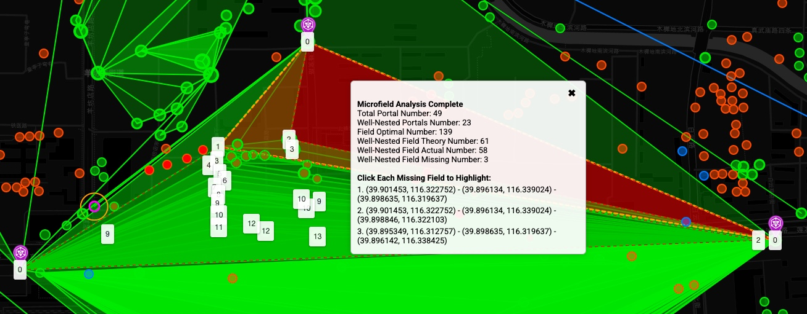

# IITC Plugin: Microfield Checker

**Microfield Checker** is an IITC (Ingress Intel Total Conversion) plugin that checks microfield nesting based on a triangle of portals. It identifies potential nested microfields, computes nesting levels, and highlights missing fields to help reflect fielding strategies.

---

## 🔍 Application Scenarios

- Ideal for verifying **nearly-completed microfield**.
- Especially useful in **densely linked and portal-rich areas** where visual inspection becomes difficult.

---

## 📦 Features

* Select 3 linked portals as a base triangle using the **DrawTools** plugin
* Automatically discover all portals nested within the triangle
* Check if each nested portal forms valid microfields with all three triangle corners
* Recursively build nesting layers using geometric and link conditions
* Visualize nesting levels with colored circular markers and numeric labels
* Highlight missing fields using semi-transparent red geodesic triangle overlays
* Display a draggable, closable summary panel with detailed field statistics and interactive missing field list

---

## 🧩 How It Works

1. You draw **3 markers** using the **DrawTools** plugin to define the base triangle
2. The plugin matches these markers to actual **portals** on the map
3. It verifies whether the 3 portals are **fully linked**, forming a valid triangle
4. All other portals inside this triangle are **analyzed recursively**:

   * If a portal can link to all 3 triangle vertices, it is considered **well-nested**
   * New triangles are formed, and the nesting **level** increases
5. If a triangle of 3 linked portals **does not correspond to an actual field**, it is flagged as a **missing field**

---

## 📊 Output

After running the plugin, you’ll see:

* **Colored circular markers** for all nested portals, each labeled with its nesting level
* **Red circular markers** for portals that were inside the triangle but not used in any nesting
* **Semi-transparent red geodesic triangles** for each missing field
* A **draggable info panel** summarizing:

  * Total number of portals inside the base triangle
  * Number of **well-nested** portals (including base)
  * **Optimal** field count for perfect nesting
  * **Theoretical** number of nested fields based on portal count
  * **Actual** number of fields (i.e., those confirmed to exist)
  * **Missing** field count
  * Clickable list of each missing triangle’s coordinates to highlight on the map

---

## ✅ Requirements

- **IITC CE** or compatible IITC build
- **DrawTools** plugin (required for placing markers)

---

## 🖱️ Usage

1. Open the Ingress Intel Map with IITC enabled.
2. Use the **DrawTools** plugin to place exactly **3 markers** around 3 portals you’ve linked.
3. Click the **"Check-Microfield"** button in the IITC toolbox.
4. Review the visual output and statistics.

---

## 🛠️ Limitations

- Markers must match exact portal positions (with small coordinate tolerance).
- All 3 base portals must be linked to each other.
- Does not auto-link or create fields; purely analytical.
- Field detection relies on portal and field data already loaded on the map.
